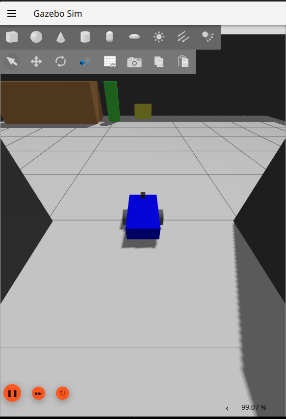

# Autonomous Hotel Delivery Robot using ROS2

A ROS2 package for autonomous delivery robot navigation in a hotel environment using SLAM and Nav2.

---

## Features

- Gazebo simulation with a differential drive robot
- LiDAR-based environment perception
- SLAM-based mapping using SLAM Toolbox
- Pre-built hotel map for autonomous navigation
- Support for an 8-room hotel layout
- RViz visualization and teleoperation

---

## Technologies Used

- ROS 2 Jazzy
- Gazebo Harmonic
- SLAM Toolbox
- Nav2
- RViz2
- ros2_control
- ros_gz_bridge

---

## Simulation Environment


---

## Robot Model



---

## SLAM Mapping Process


---

## Final Occupancy Grid Map


---

## Requirements

- ROS 2 Jazzy
- Nav2
- SLAM Toolbox
- Gazebo Harmonic

---

## Installation

```bash
cd ~/ros2_ws/src

# Clone this repository
git clone <repository_url>

cd ~/ros2_ws

colcon build --packages-select hotel_launch

source install/setup.bash
```

---

## Usage

### Mapping

```bash
ros2 launch hotel_launch mapping.launch.py
```

### Navigation

Use the provided map files:

```text
maps/hotel_map.yaml
maps/hotel_map.pgm
```

for localization and autonomous navigation tasks.

---

## Project Structure

```text
hotel_launch/
├── config/      # Controller, SLAM and bridge configurations
├── launch/      # Launch files
├── maps/        # Saved occupancy grid maps
├── models/      # Custom robot and sensor models
├── screenshots/ # Project screenshots
├── urdf/        # Robot descriptions
├── package.xml
├── CMakeLists.txt
└── README.md
```

---

## Results

Successfully generated a 2D occupancy grid map of a custom hotel environment using a simulated LiDAR sensor and SLAM Toolbox.

---

## Future Work

- AMCL Localization
- Nav2 Autonomous Navigation
- Autonomous Room Delivery
- Multi-goal waypoint navigation
- Hotel service task scheduling

---

## Author

**Tanmay Madaan**  
B.E. Robotics and Artificial Intelligence  
Thapar Institute of Engineering and Technology

---

## License

MIT License
